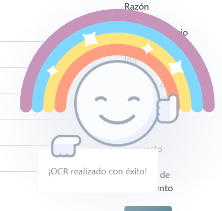
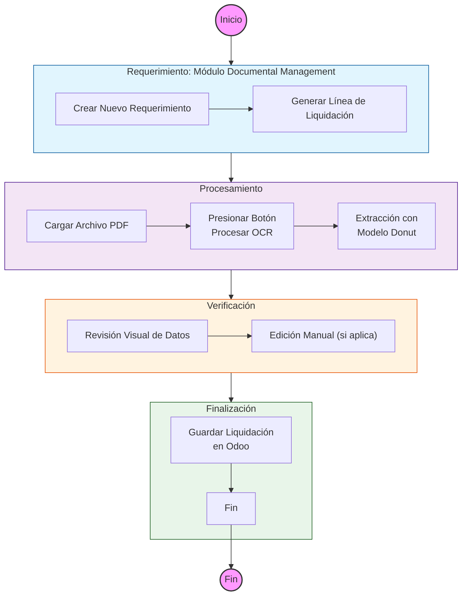

# Flujo de Trabajo OCR

El flujo de trabajo de OCR permite procesar documentos (PDFs) y extraer información clave para autocompletar campos en registros de Odoo.

## Responsables involucrados

| Rol Responsable | Responsabilidad | Grupo Permisos |
| :--- | :--- | :--- |
| Usuario Generico | Cualquier usuario que tenga acceso al módulo de Documental Management puede generar el requerimiento y liquidación donde subirá el archivo para ser procesado por el OCR. | base.group_user |

---
## Proceso Paso a Paso

El proceso se divide en cuatro fases clave diseñadas para transformar la información de un documento PDF en datos estructurados y listos para usar dentro de Odoo.

1. **Inicio del Requerimiento:**
    El usuario comienza su flujo de trabajo habitual dentro del módulo de **Documental Management**. Aquí debe crear un nuevo requerimiento, completar los campos obligatorios de la cabecera y proceder a generar una nueva línea de liquidación.

2. **Carga de Archivo y Extracción OCR:**
    Dentro del asistente (wizard) de la línea de liquidación, el usuario debe cargar el archivo PDF de la factura. Una vez cargado, debe pulsar el botón **"Procesar OCR"**.
    *   **¿Qué sucede detrás?** El sistema envía el documento a nuestro servidor especializado que, mediante inteligencia artificial (modelo `DONUT`), identifica y extrae los datos.
    *   > **IMPORTANTE:**
        Actualmente, el sistema está optimizado exclusivamente para **Facturas**. La compatibilidad con otros tipos de documentos se implementará en futuras versiones.

3. **Confirmación de Procesamiento:**
    Si la extracción es exitosa, el sistema mostrará un mensaje de confirmación en pantalla:
    <figure markdown="span">
        { width="300" }
    </figure>
    Este mensaje indica que los campos de la liquidación han sido autocompletados con la información detectada en el PDF.

4. **Verificación Humana y Registro Final:**
    Como paso final y más importante, el usuario debe actuar como filtro de calidad:
    *   **Revisión Visual:** Comprobar que los campos (RUC, Fecha, Serie, Número, Montos) coincidan exactamente con lo que muestra la factura física o digital.
    *   **Corrección:** Si algún dato no fue detectado correctamente, el usuario puede editar el campo manualmente en ese momento.
    *   **Finalización:** Una vez validada la información, se presiona **Guardar** para registrar oficialmente la línea de liquidación.
---

## Diagrama de Flujo

