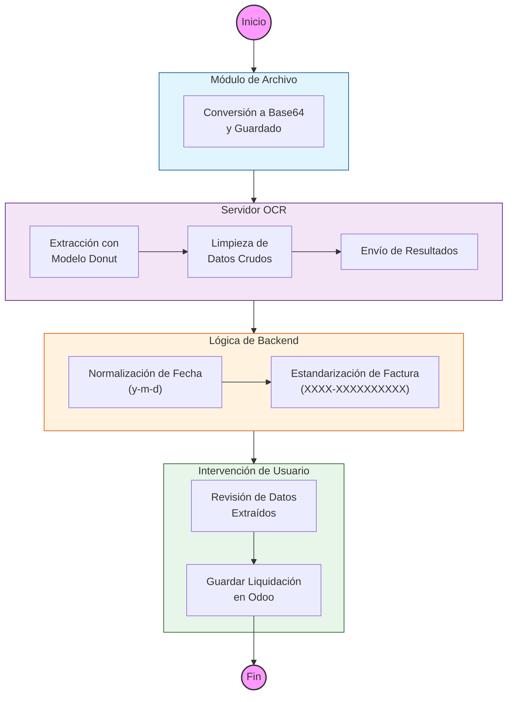

# Guía Técnica: OCR

Esta sección describe la arquitectura técnica, las dependencias y la lógica interna del módulo `mkt_ocr_plugin`.

## Arquitectura del Módulo

El módulo actúa como un puente entre Odoo 17 y un servicio externo de OCR, gestionando las peticiones, procesando las respuestas JSON y mapeando los resultados a campos de Odoo.

---

## Estructura de Archivos

*   `models/`: Contiene la lógica de negocio, configuración y registros (logs) del OCR.
*   `views/`: Definiciones de la interfaz de usuario para las configuraciones y los logs.
*   `security/`: Definición de grupos de acceso y permisos.
*   `utils/`: Funciones de utilidad para comunicarse con la API de OCR.

---

## Diagrama de Flujo

---