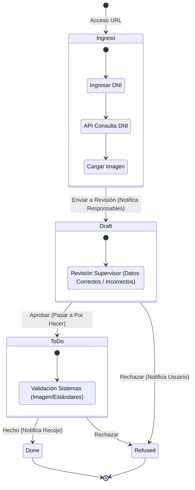

# Flujo de Trabajo

El ciclo de vida de un registro de Photocheck pasa por varios estados bien definidos.

## Responsables involucrados

| Rol Responsable | Responsabilidad | Grupo Permisos |
| :--- | :--- | :--- |
| Usuario Generico | Responsable de crear el registro de fotocheck. No tiene permisos para editar ni para visualizar sus propios registros. | - |
| Usuario Photocheck | Responsable de crear, ver y editar sus propios registros de fotocheck. | photocheck_user |
| Supervisor | Responsable de aprobar el fotocheck y ver los registros de su equipo. | photocheck_boss|
| Técnico de Sistemas | Responsable de validar que la imagen cumpla con los estándares técnicos requeridos. | photocheck_designer|

---

## Ajustes Necesarios para iniciar con el Flujo:
Para que el flujo de Fotochecks funcione correctamente, es fundamental completar las siguientes configuraciones en el apartado de Configuraciones:

1. **Ciudades (Fotocheck Ciudad):** Registra todas las sedes o ubicaciones geográficas donde opera el personal. Estas ciudades servirán más adelante para filtrar qué registros puede ver cada usuario.
2. **Cargos (Fotocheck Cargos):** Ingresa el catálogo de puestos laborales (ej. Mercaderista, Promotor, Supervisor) que se imprimirán en los fotochecks.
3. **Grupos de Marcas (Grupos de marcas Fotocheck):** Configuración central donde se agrupan las marcas y se definen los accesos.
    * **Marcas**: Lista de marcas que pertenecen al grupo.
    * **Responsables (Pestaña)**: Aquí se asignan los usuarios operativos. Aquellas personas que apareceran en los desplegables de los formularios.
4. **Supervisores (Fotocheck Supervisor):** Configuración de la autoridad del flujo.
    * Aquí se registra a los usuarios que tienen poder de aprobación.
    * Se debe vincular al supervisor con sus **Grupos de Marcas** y **Ciudades** para que, cuando un Responsable envíe una solicitud, el sistema sepa a qué Supervisor notificarle por correo.
---

## Proceso Paso a Paso

1.  **Creación:** El usuario ingresa a la direccion `https://marketing-alterno.app/photocheck`, al ingresar el número de documento, el sistema completa automáticamente los campos de nombres y apellidos mediante la [API DNI](classes/utils/api_dni/functions.md).
2.  **Validación de Datos:** Es responsabilidad del usuario verificar que los datos autocompletados coincidan exactamente con su documento oficial de identidad antes de continuar.
3. **Finalizacion del formulario** Se deben completar los campos restantes del formulario: cargo, marca, ciudad y supervisor. Para finalizar esta etapa, el usuario debe tomarse una fotografía cumpliendo los siguientes requisitos para poder subirla: 
    * Que se vea el rostro del usuario del pecho hacia arriba y centrado.
    * Sin accesorios.
    * Sin gorras, lentes, etc.
4.  **Procesar Foto:** Se utilizara la herramienta de eliminación de fondo [`modify_image`](../technical/classes/Photocheck/functions.md#modify-image).
5.  **Enviar a "Borrador":** Al presionar el botón `Enviar`, el estado de la solicitud cambia a `Borrador`.
6.  **Revision Supervisor:** El supervisor evalúa la solicitud y determina su curso:
    * **Enviar**: Cambia el estado a `Por Hacer`.
    * **Corrección**: Pide al usuario creador que modifique los datos del registro y lo envie nuevamente.
7.  **Por Hacer:** El encargado del área de Sistemas valida que la imagen cumpla con los estándares técnicos requeridos:
    * **Si cumple**: Se marca como `Hecho` y se envía un correo de confirmación al supervisor para la entrega del fotocheck físico.
    * **No cumple**: La solicitud se marca como `Rechazado` para su corrección.
8.  **Hecho:** Una vez que el estado es `Hecho`, el proceso se considera completado exitosamente y el fotocheck queda listo para ser entregado al supervisor o usuario enviado por este mismo.
---

## Estados del Registro

| Estado | Descripción |
| :--- | :--- |
| **Borrador (Draft)** | El registro está siendo creado. La información aún puede ser modificada libremente. Pendiente a revision por parte del(los) supervisor(es) asignado(s). |
| **Por Hacer (To Do)** | El registro ha sido enviado para su procesamiento|
| **Realizado (Done)** | El fotocheck ha sido procesado y completado exitosamente. |
| **Rechazado (Refused)** | La solicitud ha sido rechazada (ej. por datos incorrectos o foto de mala calidad). |

---

## Diagrama de Flujo

